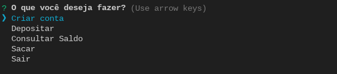
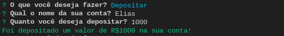
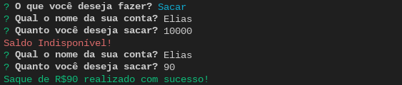

# Banco via terminal
O intuito desse projeto é aplicar meus conhecimentos em node usando tanto os Cores Modules como também lib externas, seguindo o padrão de desenvolvimento com Arrow Functions e utilizando promisses com then e catch.
Estou usando o inquirer como interface no terminal, o chalk para alterar as cores dos logs e deixar visualmente mais agradável e o fs para alterar os arquivos JSON que estão sendo criados na pasta accounts e são utilizados como memória.

## O Projeto

## Instalação
Esse projeto foi feito na versão 20.10.0 do NodeJS, para usar na sua maquina basta copiar a URL do repositório e rodar o comando

~~~
  git clone 
~~~

Depois disso, vamos instalar todas as dependências com o comando

~~~
npm install
~~~

Por fim, para iniciar o programa basta rodar o seguinte comando no terminal
~~~
npm start
~~~

## Tecnologias
Nesse projeto foram utilizados as seguintes tecnologias e bilbiotecas
- NodeJS 20.10.0
- chalk (biblioteca que permite alterar a cor dos logs)
- inquirer (biblioteca que permite usar pronpts no terminal)
- fs (core module do node que permite a manipulação de arquivos)
